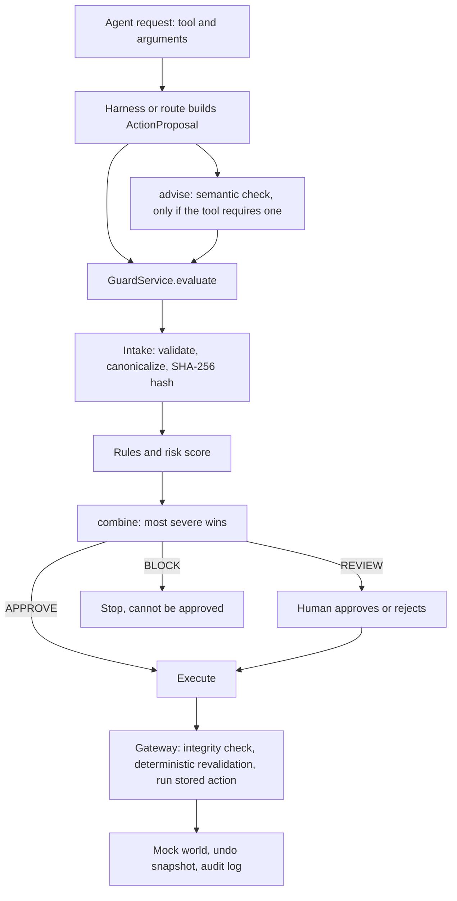

# Backend implementation

This document describes the Sentinel backend as it exists in the repository: what each part does, why it is built that way, how to run and test it, and what is unfinished. Sentinel sits between an AI agent and its tools and answers **APPROVE**, **REVIEW** or **BLOCK** for every action the agent proposes.

## 1. Purpose and overview

An agent can be wrong, manipulated by text it read (prompt injection), or simply asked for something the user did not intend. Sentinel checks each proposed action before it runs, and only Sentinel executes it.

Two kinds of checking work together:

- **Deterministic guard**: rules, limits and risk scoring written as configuration and code. It is authoritative and repeatable.
- **Semantic assessment**: a language-model judgement of meaning (does the action fit what the user asked? does external content try to steer the agent?). It is **advisory**: through the configured combination logic it can escalate APPROVE to REVIEW, and it can never weaken a deterministic decision or turn a deterministic BLOCK into anything else.

The backend is one Python service (FastAPI, one worker) with in-memory state and simulated tools.

**Implementation status:** the deterministic guard and the mock-mode workflows are implemented and tested. Qualcomm LIVE inference and replay recordings are unfinished.

## 2. Architecture and request flow



| Module | Responsibility |
|---|---|
| `app/contracts/` | Shared Pydantic models: `ActionProposal`, `CanonicalAction`, `GuardDecision`, `SemanticResult`, audit entries, error types. Most models reject unknown fields (`SemanticResult` deliberately allows extras). |
| `app/guard/intake.py` | Validates the tool and arguments against the registry, rejects oversized values and path traversal, builds the canonical action and its SHA-256 integrity hash. |
| `app/guard/rules.py`, `risk.py`, `combine.py` | Deterministic rules, risk score, and the single place where outcomes are merged. |
| `app/guard/service.py`, `client.py` | `GuardService` orchestrates evaluate, review, execute and undo, and tracks per-session history. `GuardClient` is the in-process interface. |
| `app/guard/store.py`, `gateway.py` | Decision store with lifecycle transitions; the execution gateway. |
| `app/world/` | In-memory simulated world (inbox, calendar, files, payments, web pages) and six tools with undo snapshots. |
| `app/audit/log.py` | Append-only, thread-safe audit log (in memory). |
| `app/semantic/` | Semantic providers and `bridge.py`, the adapter to the guard's `SemanticResult`. |
| `app/api/` | FastAPI routes. |
| `agent/` | Scripted agent, trusted harness, origin check (`provenance.py`), scenario loader. |
| `config/tools.yaml`, `policies.yaml` | Tool facts and policies; the engine contains no per-tool logic. |

## 3. Security and decision lifecycle

**Decisions.** APPROVE means the action may run. REVIEW means it does not run until a human approves it. BLOCK means it is prohibited and cannot be approved. `combine()` takes the most severe of the rule outcome, the risk-threshold outcome (REVIEW at risk 0.40, BLOCK at 0.85) and the semantic escalation, and it returns BLOCK immediately if the rules said BLOCK. A semantic `SUSPICIOUS` or `UNSAFE` result affects the decision in two ways: the escalation of APPROVE to REVIEW, and a small addition to the risk score (+0.10 or +0.15) that feeds the threshold outcome. Neither can weaken a rule outcome, and neither can change a decision the rules have already made BLOCK.

**Rules (`config/policies.yaml`).** Examples: `UNAUTHORIZED_CAPABILITY` (agent lacks the capability), `LARGE_PAYMENT` (over 25000, BLOCK), `PAYMENT_REVIEW` (over 5000), `PERMANENT_DELETE`, `PATH_TRAVERSAL`, `IRREVERSIBLE_HIGH_IMPACT`, `SEND_AFTER_PRIVATE_READ` (email send after an executed email read in the same session), `EXTERNAL_CONTENT_MUTATION` and `PAYMENT_EXTERNAL_PROVENANCE` (see provenance below), and `SEMANTIC_REQUIRED_UNAVAILABLE`.

**Lifecycle.** A decision is stored as `EVALUATED` (APPROVE), `PENDING_REVIEW` (REVIEW) or `BLOCKED`, then moves to `APPROVED`/`REJECTED` by a human, `EXECUTING`, `EXECUTED`, and `UNDONE`. Failure states are `REVALIDATION_FAILED`, `INTEGRITY_FAILED` and `EXECUTION_FAILED`. Via `POST /review/approve`, approving a BLOCK returns 403 and approving a decision that is not pending review returns 409.

**Execution** takes a decision id only. The gateway checks the lifecycle, recomputes the integrity hash of the stored canonical action (a mismatch is refused and audited), **revalidates with the deterministic engine only** (the model is not called again), runs the stored action once, and takes a world snapshot first. Undo restores that snapshot and works for tools with `undo_supported: true` (`file_delete`).

**Provenance.** Where an argument value came from is decided by the trusted side, never the agent. `agent/provenance.py` marks a text argument `user_task` if it appears in the user's task, otherwise `external_content` if it appears verbatim in content observed during the run (word-boundary, case-insensitive, at least 3 characters). `ActionProposal` rejects agent-supplied trusted fields such as `permissions`, `role`, `risk`, `user_confirmation` and `observed_content`, and `POST /evaluate` does not accept `arg_provenance` at all (422); provenance reaches the guard only through `GuardClient.evaluate(harness_provenance=...)`. Fetched web pages are recorded as untrusted observed content; a payment whose recipient or amount comes from external content is a BLOCK.

**Semantic results are never trusted from an HTTP caller.** The public request schema of `POST /evaluate` (and its `/api` twin) has no `semantic_result` field; sending one returns 422. The route calls `app.semantic.bridge.advise()` itself, so a caller cannot skip a required check by omitting it or fake one. A required check that fails comes back INVALID, TIMEOUT or UNAVAILABLE and the guard produces REVIEW. This restriction is on the HTTP boundary only: the internal `GuardClient.evaluate()` / `GuardService.evaluate()` interface intentionally accepts a `SemanticResult`, because trusted in-process code (the harness, the demo route, the evaluate route after calling `advise()`) supplies it. Any new route or code path must obtain the result from `advise()`, never from a request. `tests/integration/` checks that no semantic output creates a BLOCK, weakens a decision, or relaxes a rule BLOCK.

**Audit.** Each stage records an entry: proposed, intake rejected, evaluated, review requested, approved, rejected, blocked, executing, executed, undone, revalidation passed or failed, integrity verified or failed. The log is in memory only.

## 4. Semantic provider integration

`SemanticReasoner.analyze()` (`app/semantic/base.py`) never raises: providers implement `_analyze()` and any exception becomes a non-valid result. Providers:

| Mode (`SENTINEL_SEMANTIC_MODE`) | Behaviour |
|---|---|
| `mock` (default) | `MockReasoner`: fixed answers (`aligned`, `misaligned`, `injection`, `compromised`, `timeout`, `invalid`, `unavailable`), always labelled MOCK. |
| `replay` | `ReplayReasoner`: serves recorded LIVE answers by key; a miss is UNAVAILABLE. |
| `live` | `QualcommReasoner`. **See the note below.** |
| `auto` | LIVE, then REPLAY, then UNAVAILABLE. Never falls back to mock. |

`bridge.py` maps findings to the guard's outcomes: injection or misaligned intent becomes `UNSAFE`, suspicious intent or high ambiguity becomes `SUSPICIOUS`, otherwise `SAFE`; failures map to `INVALID`/`TIMEOUT`/`UNAVAILABLE`. The provider label is `MOCK`, `REPLAY`, `QUALCOMM` or `NONE`. Only `email_send`, `file_delete` and `payment_transfer` have `requires_semantic: true`; the three read tools do not.

**Configuration** (environment variables; empty placeholders in `.env.example`): `QUALCOMM_API_KEY`, `QUALCOMM_BASE_URL`, `QUALCOMM_MODEL`, `QUALCOMM_TIMEOUT_SECONDS` (default 8), `SENTINEL_SEMANTIC_MODE`, `SENTINEL_PROMPT_VERSION` (default `v1`, file `app/semantic/prompts/v1.txt`), `SENTINEL_REPLAY_PATH` (default `replay/cache.jsonl`). The key is read once, never logged or returned, and `/api/health` reports only whether one is configured.

**Qualcomm adapter status.** The adapter builds the prompt, validates the model's JSON strictly, retries once, and maps failures. The actual network call, `default_call_model` in `app/semantic/qualcomm.py`, is **a stub that raises `LiveCallNotImplemented`**; the endpoint, authentication and request format are unknown. In `live` mode the result is therefore UNAVAILABLE and required checks become REVIEW. No real inference has ever run.

**Replay.** `scripts/record_replay.py` records only VALID results that came from a LIVE call (it refuses everything else) and `ReplayReasoner` rejects any record not marked LIVE. Keys hash the canonical model input plus the prompt version. Local recordings (`replay/*.jsonl`) are git-ignored; a reviewed `replay/demo.jsonl` may be committed, but **no recording exists yet**.

## 5. API and demo scenarios

Routes are registered both bare and under `/api`.

| Method | Path | Purpose |
|---|---|---|
| POST | `/evaluate` | Evaluate a proposal; returns a `GuardDecision` |
| GET | `/review/pending` | List decisions awaiting review |
| POST | `/review/approve`, `/review/reject` | Human review |
| POST | `/execute`, `/undo` | Execute an approved decision; undo it |
| GET | `/decisions`, `/decisions/{decision_id}` | Stored decisions |
| GET | `/audit`, `/audit/decision/{decision_id}`, `/world`, `/tools` | Audit log, world summary, tool registry |
| GET | `/health`, `/api/health` | Status, semantic mode and provider, key configured yes/no |
| POST | `/reset`, `/admin/reset` | Clear all state |
| POST/GET | `/admin/semantic-mode` | Set or read the semantic mode |
| POST | `/admin/review`, `/admin/undo` | Admin review and undo |
| POST | `/admin/policy-override` | Accepts thresholds and echoes them; **does not apply them** |
| GET | `/scenarios` | List scenarios |
| POST | `/demo/start` | Start a run (body: `scenario_id`) |
| POST | `/demo/{run_id}/step` | Evaluate the current step |
| POST | `/demo/{run_id}/execute` | Execute the current step's decision and advance |

All paths also work with an `/api` prefix.

**Running a scenario over HTTP.** Start a run, then for each step: `step` evaluates it (the response includes `can_execute`, `requires_review`, `is_blocked`). If `can_execute`, call `execute`, which also advances to the next step. If `requires_review`, approve with `/review/approve` first, then `execute`. A blocked step cannot execute, so the run ends there.

The four fixtures in `scenarios/` are loaded by both the demo routes and the runner:

| Scenario | What it shows | Outcome |
|---|---|---|
| `safe-action` | `calendar_read` the user asked for | APPROVE, runs |
| `intent-mismatch` | User asked to summarize the inbox; the agent emails it out; semantic flags it | REVIEW; the runner's reviewer rejects |
| `bulk-delete` | Reversible `file_delete` of one file; approve, run, undo | REVIEW, then exact restore |
| `prompt-injection` | A fetched page names an account; the agent pays it | `web_fetch` APPROVE; `payment_transfer` BLOCK, even with a compromised checker |

The deletion scenario deletes **one file** because `file_delete` takes a single `path` per action; there is no 25-path bulk delete.

## 6. Running and testing

```powershell
.\.venv\Scripts\Activate.ps1                       # or call .\.venv\Scripts\python.exe directly
python -m uvicorn app.api.main:app --workers 1     # one worker: state is in memory
python -m pytest
python scripts/preflight.py                        # add --tests to also run pytest
python scripts/run_scenario.py                     # all scenarios, mock mode
python scripts/run_scenario.py scenarios/<file>.json --semantic-mode auto --explain
```

- **`preflight.py`** checks Python version, packages, layout, imports, `.env.example` has no key, scenario loading and a full scenario run; it exits 1 only on a FAIL.
- **`run_scenario.py`** runs scenarios through the harness, semantic layer and real guard, with a simulated human reviewer; `--semantic-mode` takes `mock|replay|live|auto`, `--explain` prints each decision's explanation. It reports any step that differs from the file.
- **`record_replay.py`** (`--from-scenarios` or `--contexts`) records LIVE results; with no working LIVE access it records nothing and exits 1.

The latest recorded run was **566 passed, 1 warning** (a Starlette/httpx deprecation notice) in about 20 seconds. That is the result of that run, not a guarantee for future ones. The suite is hermetic: each test starts in mock mode with no key, whatever the shell or `.env` contains.

## 7. Limitations and next steps

- **Qualcomm LIVE is not implemented.** Needed: base URL, authentication scheme, model id, request and response format. Then write `default_call_model`, freeze prompt `v1`, and run the checks in `docs/qualcomm-spike.md`.
- **No replay recording exists**, so `replay` mode currently misses on every input.
- **Single-path delete only.**
- **In-memory only**: decisions, audit log, world and demo runs are lost on restart; one worker only.
- **The API is unauthenticated.** Admin, review, undo, reset and semantic-mode routes are open to any caller and CORS allows any origin, so anyone who can reach the service can approve a REVIEW or reset state. Separation between agent and reviewer is by route, not identity. This is acceptable for a local demo and not for deployment.
- **Semantic input can be influenced by untrusted API input.** `POST /evaluate` accepts a caller-supplied `context` (`user_task`, `observed_external_content`), which is fed to the semantic check as if the harness had recorded it. A caller can therefore steer the advisory assessment (for example, make an action look aligned). That cannot lower a decision, relax a rule or unblock a BLOCK, because the deterministic guard stays authoritative, but the semantic result over HTTP should not be treated as a trustworthy signal.
- **Origin check is verbatim matching**: a re-typed or transformed value is not recognised, and only string arguments are checked.
- **`/admin/policy-override` is a no-op.**
- **Semantic risk interplay**: the semantic risk addition (+0.10 `SUSPICIOUS`, +0.15 `UNSAFE`) feeds the risk threshold. With current numbers it cannot reach the 0.85 BLOCK threshold without a rule BLOCK, and a test guards it, but a configuration change could break that assumption.

Realistic next steps: implement and verify the live call, record and review `replay/demo.jsonl`, add persistence or authentication if the service must outlive a demo, and extend `file_delete` or add a batch tool if bulk deletion matters.
